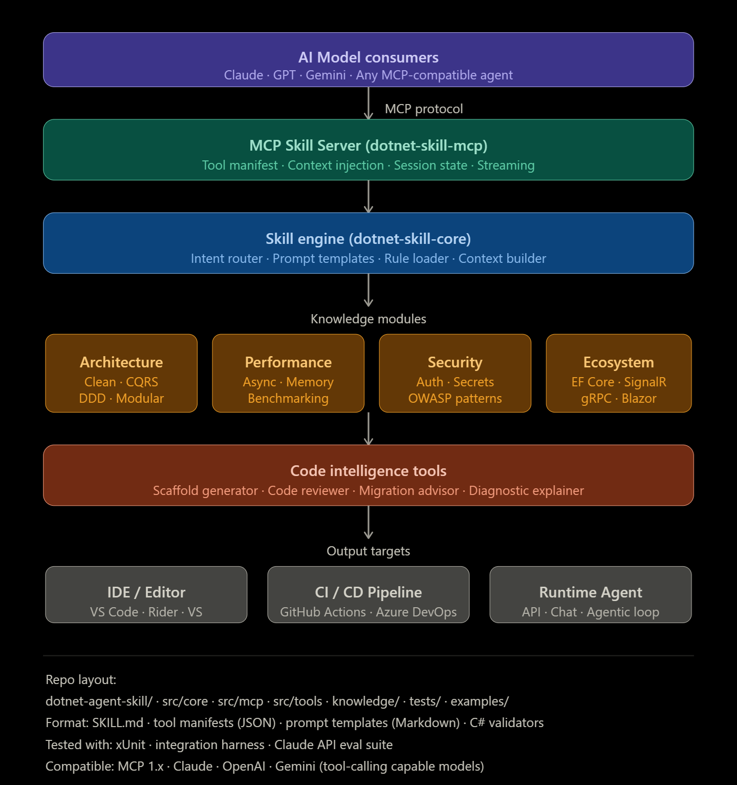

# 🧠 .NET MCP Skill Engine

A modular, production-ready architecture for building **AI-powered skills in .NET** using the **Model Context Protocol (MCP)**.

This project demonstrates how to design scalable, maintainable, and secure AI-integrated systems that work across multiple LLM providers (OpenAI, Claude, Gemini).

---

## 📌 Overview

This repository provides a reference architecture for:

* AI skill orchestration
* MCP-compatible tool servers
* Intent-driven execution engines
* Modular knowledge systems
* Developer productivity tooling

---

## 🏗️ Architecture



### Flow:

1. **AI Model Consumers**

   * Claude, GPT, Gemini, or any MCP-compatible agent

2. **MCP Skill Server (`dotnet-skill-mcp`)**

   * Tool manifest
   * Context injection
   * Session state
   * Streaming

3. **Skill Engine (`dotnet-skill-core`)**

   * Intent routing
   * Prompt templates
   * Rule engine
   * Context builder

4. **Knowledge Modules**

   * Architecture (Clean, CQRS, DDD)
   * Performance (Async, Memory, Benchmarking)
   * Security (Auth, Secrets, OWASP)
   * Ecosystem (EF Core, SignalR, gRPC, Blazor)

5. **Code Intelligence Tools**

   * Scaffold generator
   * Code reviewer
   * Migration advisor
   * Diagnostic explainer

6. **Output Targets**

   * IDEs (VS Code, Rider, Visual Studio)
   * CI/CD (GitHub Actions, Azure DevOps)
   * Runtime agents (APIs, chat, autonomous loops)

---

## 📂 Repository Structure (Planned)

```
src/
  core/        # Skill engine
  mcp/         # MCP server implementation
  tools/       # Code intelligence tools
knowledge/     # Domain knowledge modules
tests/         # Unit & integration tests
examples/      # Sample use cases
docs/          # Architecture & guides
```

---

## 🧪 Tech Stack

* .NET (C#)
* MCP Protocol
* xUnit (testing)
* Markdown-based prompt templates
* JSON tool manifests

---

## 🎯 Goals

* Build a reusable **AI skill framework for .NET**
* Enable **multi-model compatibility**
* Promote **clean architecture + DDD in AI systems**
* Provide **developer-focused AI tooling**

---

## 🚧 Status

🟡 Initial design & architecture phase

---

## 📌 Roadmap

* [ ] MCP server implementation
* [ ] Skill engine core
* [ ] Prompt templating system
* [ ] Knowledge module examples
* [ ] CLI / tooling support
* [ ] Sample agent integration

---

## 🤝 Contributing

Contributions, ideas, and feedback are welcome!

---

## 📣 Inspiration

This project is inspired by the growing ecosystem of:

* Agentic systems
* Tool-using LLMs
* AI-assisted development workflows

---

## 🔗 Connect

If you found this interesting or want to collaborate, feel free to reach out:

- 💼 LinkedIn: [https://www.linkedin.com/in/YOUR-USERNAME](https://www.linkedin.com/in/yassine-zakhama)  
- 📧 Email: zakhamayassine@gmail.com
