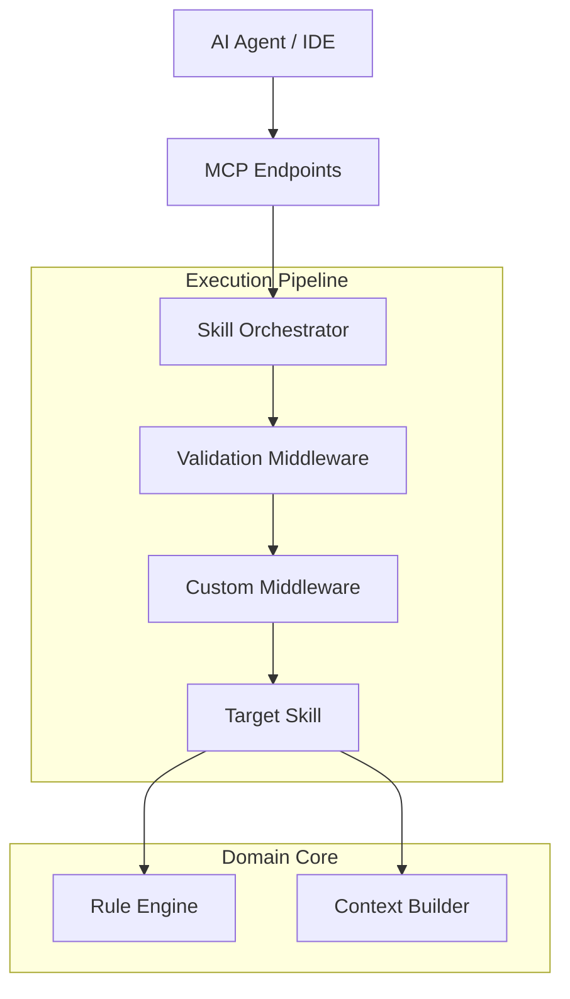
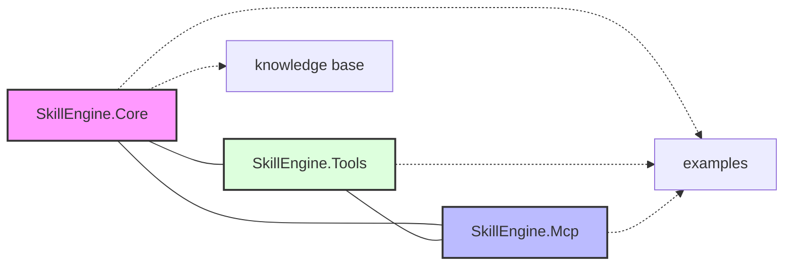

# 🧠 .NET MCP Skill Engine

A modular, production-grade framework for building **AI-powered skills in .NET** using the **Model Context Protocol (MCP)**.

[](https://dotnet.microsoft.com/download)
[](https://opensource.org/licenses/MIT)
[](#)

---

## 📌 Overview

The **.NET MCP Skill Engine** provides a highly extensible, middle-ware based orchestration system for AI agents. It allows you to build "skills" (intelligent tools) once and expose them seamlessly via the Model Context Protocol to any AI consumer (Claude, ChatGPT, etc.).

### Key Features:

- **Middleware Execution Pipeline**: Intercept and augment skill requests with validation, logging, and caching.
- **Enterprise-Grade Observability**: Native `ActivitySource` integration for full-stack OpenTelemetry tracing.
- **Lean & High Performance**: Optimized with `LoggerMessage` source generators and minimalist dependencies.
- **Rules Engine**: Flexible policy-based validation for skill invocation.
- **Built-in Code Intelligence**: A collection of pre-built skills for scaffolding, reviews, and diagnostics.

---

## 🚀 Quick Start

### 1. Register the Engine

Add the Skill Engine to your service collection in `Program.cs`:

```csharp
using SkillEngine.Core;

var builder = WebApplication.CreateBuilder(args);

// Register Core Engine
builder.Services.AddSkillEngine(options => {
    options.MaxParameters = 15;
    options.DeniedTools = ["experimental-tool"];
});

// Register Built-in Skills
builder.Services.AddSkill<ScaffoldSkill>()
                .AddSkill<CodeReviewSkill>()
                .AddSkill<ArchitectureAdvisorSkill>();

// (Optional) Add custom middleware
builder.Services.AddSkillMiddleware<PerformanceMetricsMiddleware>();
```

### 2. Invoke a Skill

Inject `SkillOrchestrator` and execute tools:

```csharp
public async Task<string> HandleRequest(SkillOrchestrator orchestrator, string toolName)
{
    var request = new SkillRequest { ToolName = toolName };
    var result = await orchestrator.InvokeAsync(request);

    return result.IsSuccess ? result.Content! : $"Error: {result.ErrorMessage}";
}
```

---

## 🏗️ Architecture

The engine follows **Clean Architecture** principles, ensuring the core logic is divorced from external protocols like MCP or HTTP.



### Advanced Senior Patterns:

- **Observability**: Uses `System.Diagnostics.Activity` to provide detailed spans during skill execution.
- **Resilience**: Middlewares can be used to implement Retry and Circuit Breaker patterns.
- **Decoupling**: The `ISkillRouter` abstracts skill discovery, allowing for dynamic loading of capabilities.

---

## 📂 Project Structure



## 🛠️ Built-in Skills

| Skill                     | Description                                               |
| :------------------------ | :-------------------------------------------------------- |
| **`scaffold`**            | Generates Clean Architecture, CQRS, and CRUD boilerplate. |
| **`review-code`**         | Expert-level security and performance code review.        |
| **`explain-error`**       | Diagnostic tool for explaining complex .NET exceptions.   |
| **`advise-architecture`** | Tailored advice on patterns (MVC, Hexagonal, etc.).       |

---

## 🎯 Roadmap

- [x] Middleware Pipeline Architecture
- [x] OpenTelemetry / Tracing support
- [x] Initial Code Intelligence tools
- [x] Multi-format Prompt Templating (Scriban)
- [ ] Distributed Caching Middleware
- [ ] Auto-discovery of Skill DLLs
- [ ] MCP streaming support

---

## 🤝 Contributing

We welcome contributions! Please see our [Developer Guide](file:///c:/Users/yzakhama/Downloads/dotnet-skill-engine/docs) for information on how to add new skills or middlewares.

---

## 📣 Connect

If you're building agentic systems with .NET, I'd love to connect!

- 💼 LinkedIn: [Yassine Zakhama](https://www.linkedin.com/in/yassine-zakhama)
- 📧 Email: zakhamayassine@gmail.com
