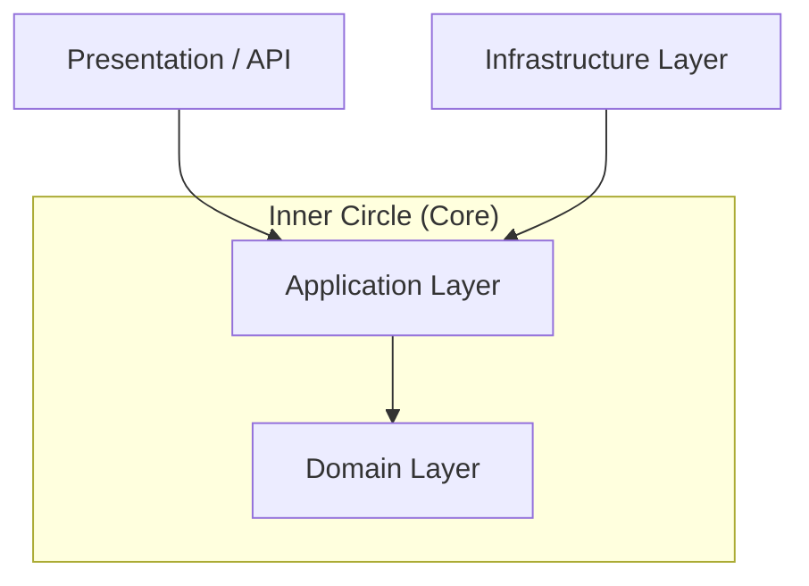

# Clean Architecture in .NET

## What Is It?

Clean Architecture, popularised by Robert C. Martin ("Uncle Bob"), organises a system into **concentric dependency layers** where every dependency points **inward** — toward the domain. The domain layer has **zero external dependencies**.



### Flow of Control vs. Dependency Direction
A common misconception is that the flow of execution matches the dependency direction. In Clean Architecture, they are often **opposites**:
- **Execution Flow:** API → Application → Infrastructure (DB)
- **Dependency Flow:** API → Application ← Infrastructure → Domain ← Application

This inversion is achieved through **Interfaces (Ports)** defined in the Application/Domain layers and implemented in Infrastructure.

## Key Rules

1. **Domain** knows nothing about Infrastructure or Application
2. **Application** depends only on Domain interfaces (ports)
3. **Infrastructure** implements ports (adapters)
4. **Presentation** depends only on Application

## When to Use

| ✅ Good Fit            | ❌ Not a Good Fit     |
| ---------------------- | --------------------- |
| Complex business logic | Simple CRUD APIs      |
| Long-lived systems     | Prototypes / MVPs     |
| Large or growing teams | Solo projects         |
| Needs full testability | Time-boxed hackathons |

## .NET Project Structure

```
MyApp/
├── MyApp.Domain/          # Entities, Value Objects, Domain Events
│   ├── Orders/
│   │   ├── Order.cs       # Aggregate Root
│   │   ├── OrderItem.cs   # Entity
│   │   └── IOrderRepo.cs  # Port (interface)
├── MyApp.Application/     # Use cases, CQRS, DTOs
│   ├── Orders/
│   │   ├── CreateOrderCommand.cs
│   │   └── CreateOrderHandler.cs
├── MyApp.Infrastructure/  # EF Core, External APIs
│   ├── Persistence/
│   │   └── EfOrderRepo.cs # Implements IOrderRepo
└── MyApp.Api/             # ASP.NET Core Minimal API
```

## Key Patterns Paired with Clean Architecture

- **CQRS** — Separate read/write models. Use `IRequest` for commands/queries.
- **MediatR Pipeline Behaviors** — Implement cross-cutting concerns like logging, validation, and performance tracing *outside* the handlers.
- **Domain Events** — Use events to decouple side effects (e.g., sending an email after order creation) within the same transaction or via an outbox pattern.
- **Result Pattern** — Avoid throwing exceptions for expected business failures; return a `Result<T>` or `OneOf<T, Error>` instead.

## Testing Strategy

| Layer          | Strategy             | Focus                                      |
| -------------- | -------------------- | ------------------------------------------ |
| **Domain**     | Unit Tests           | Pure logic, no mocks needed.               |
| **Application**| Unit Tests           | Mocking interfaces (Repos, APIs).          |
| **Infra**      | Integration Tests    | Real DB (Respawn/Testcontainers).          |
| **API**        | Functional (Web)     | End-to-end via `WebApplicationFactory`.    |

## References

- [Microsoft: Clean architecture with ASP.NET Core](https://learn.microsoft.com/en-us/dotnet/architecture/modern-web-apps-azure/common-web-application-architectures#clean-architecture)
- [ardalis/CleanArchitecture](https://github.com/ardalis/CleanArchitecture)
